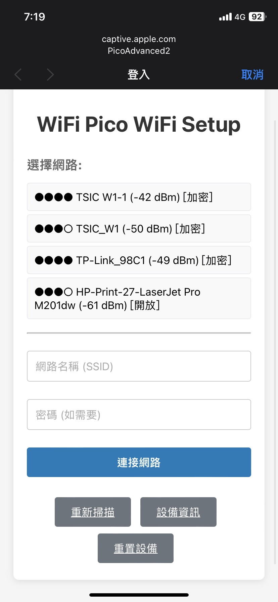
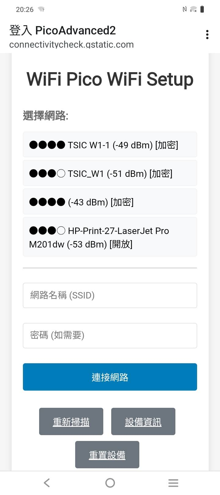

# PicoWiFiManager

[中文版 (Chinese)](README_CN.md) | [English Version](README.md)

## 📶 A Powerful WiFi Management Library for Raspberry Pi Pico 2 W

**PicoWiFiManager** is a comprehensive WiFi connection management library specifically designed and optimized for the **Raspberry Pi Pico 2 W**. It provides seamless WiFi connectivity with captive portal support, persistent storage, and advanced dual-core capabilities.

## ✨ Key Features

- **🔌 Automatic Connection Management**: Automatically connects to saved WiFi networks with fallback to configuration portal
- **🌐 Captive Portal**: User-friendly web interface with multi-device compatibility (iPhone, Android, Windows)
- **💾 Persistent Storage**: EEPROM-based credential storage with data integrity protection
- **⚡ Dual-Core Support**: Utilizes Pico 2 W's dual-core architecture for optimal performance
- **📱 Mobile-Friendly**: Responsive design optimized for smartphones and tablets
- **🔧 Advanced Configuration**: Static IP, custom DNS, timeout settings, and more
- **🛡️ Robust Error Handling**: Automatic reconnection, corruption detection, and recovery
- **📊 Comprehensive Diagnostics**: Detailed status monitoring and debugging tools
- **🚀 Pico-Optimized**: Built specifically for RP2350 + CYW43439 WiFi chip
- **🔍 Network Scanner**: Advanced WiFi network scanning and filtering

## 🏗️ Architecture

```
PicoWiFiManager/
├── PicoWiFiManager.h      # Main class interface
├── PicoWiFiManager.cpp    # Core implementation  
├── ConfigPortal.h         # Web configuration interface
├── StorageManager.h       # Flash storage management
├── NetworkScanner.h       # WiFi scanning and filtering
└── examples/
    ├── Basic/             # Simple usage example
    ├── Advanced/          # Feature demonstration
    └── DualCore/          # Dual-core utilization
```

## 🚀 Quick Start

### Basic Usage

```cpp
#include "PicoWiFiManager.h"

PicoWiFiManager wifiManager;

void setup() {
    Serial.begin(115200);
    
    // Initialize and auto-connect
    wifiManager.begin();
    wifiManager.autoConnect("MyPico2W");
    
    Serial.println("WiFi connected!");
    Serial.println(wifiManager.getLocalIP());
}

void loop() {
    wifiManager.loop();
}
```

### Advanced Configuration

```cpp
#include "PicoWiFiManager.h"

// Custom configuration
PicoWiFiConfig config;
PicoWiFiManager wifiManager;

void setup() {
    // Configure settings
    strcpy(config.deviceName, "MyAdvancedPico");
    strcpy(config.apPassword, "mypassword123");
    config.configPortalTimeout = 300;  // 5 minutes
    config.useStaticIP = true;
    config.staticIP = IPAddress(192, 168, 1, 100);
    config.gateway = IPAddress(192, 168, 1, 1);
    config.subnet = IPAddress(255, 255, 255, 0);
    
    wifiManager.setConfig(config);
    
    // Set up callbacks
    wifiManager.onConnect([]() {
        Serial.println("Connected to WiFi!");
    });
    
    wifiManager.onConfigModeStart([]() {
        Serial.println("Config portal started");
        Serial.println("Connect to: MyAdvancedPico");
        Serial.println("Password: mypassword123");
        Serial.println("Browser: http://192.168.4.1");
    });
    
    // Initialize and connect
    wifiManager.begin();
    wifiManager.autoConnect();
}

void loop() {
    wifiManager.loop();
    
    // Your application code here
}
```

## 📱 Configuration Portal

When the Pico can't connect to saved WiFi networks, it automatically creates an access point:

1. **Connect** to the WiFi network (default: device name)
2. **Open browser** to `http://192.168.4.1`  
3. **Select network** from the scanned list
4. **Enter password** and save
5. **Device restarts** and connects to your network

### Portal Features

- 📡 **Live network scanning** with signal strength
- 🔐 **Security indicators** (WPA2, WPA3, Open)
- 📊 **Signal quality display**
- ⚙️ **Advanced network settings**
- 📱 **Mobile-responsive design**
- ℹ️ **Device information page**

### Multi-Device Compatibility

The configuration portal is optimized for all devices with responsive design:

<div align="center">

| iOS Device | Android Device |
|:----------:|:-------------:|
|  |  |
| **iPhone/iPad Interface** | **Android Interface** |

</div>

✅ **Tested on**: iPhone, iPad, Android phones/tablets, Windows PCs, Mac, Linux browsers

## 🔧 API Reference

### Core Methods

```cpp
// Initialization
bool begin();
bool autoConnect();
bool autoConnect(const char* ssid, const char* password = nullptr);

// Portal Management  
bool startConfigPortal();
bool startConfigPortal(const char* ssid, const char* password = nullptr);
void stopConfigPortal();

// Network Control
void reset();           // Factory reset
void disconnect();      // Disconnect WiFi
void loop();           // Must call in main loop

// Status & Information
bool isConnected();
bool isConfigMode();
ConnectionStatus getStatus();
String getSSID();
IPAddress getLocalIP();
int32_t getRSSI();
String getMACAddress();
```

### Configuration

```cpp
// Device Settings
void setDeviceName(const char* name);
void setTimeout(uint16_t seconds);
void setResetPin(uint8_t pin);
void setLEDPin(uint8_t pin);

// Custom Configuration
void setConfig(const PicoWiFiConfig& config);
PicoWiFiConfig getConfig();
```

### Callbacks

```cpp
// Connection Events
void onConnect(PicoWiFiCallback callback);
void onDisconnect(PicoWiFiCallback callback);
void onConfigModeStart(PicoWiFiCallback callback);
void onConfigModeEnd(PicoWiFiCallback callback);
void onStatusChange(StatusCallback callback);
```

## 🔄 Dual-Core Support

Leverage Pico's dual-core architecture:

```cpp
PicoWiFiManager wifiManager;

void setup() {
    wifiManager.begin();
    wifiManager.enableDualCore(true);
    
    // Core 0: WiFi management automatically
    // Core 1: Your application code
    multicore_launch_core1(core1_task);
}

void core1_task() {
    while (true) {
        // Your intensive application logic here
        // WiFi managed on Core 0
        processsensors();
        runAlgorithms();
        sleep_ms(100);
    }
}

void loop() {
    // Core 0: Handle WiFi events
    wifiManager.loop();
}
```

## 💾 Storage Management

Persistent storage with corruption recovery:

```cpp
// Storage is handled automatically, but you can access it:
StorageManager storage;
storage.begin();

// Save custom WiFi credentials
storage.saveWiFiCredentials("MyNetwork", "password123");

// Load credentials
WiFiCredentials creds;
if (storage.loadWiFiCredentials(creds)) {
    Serial.println("Loaded: " + String(creds.ssid));
}

// Storage diagnostics
storage.printDiagnostics();
storage.performIntegrityCheck();
```

## 🔍 Network Scanning

Advanced network discovery:

```cpp
NetworkScanner scanner;
ScanConfig config;

// Configure scanning
config.showHidden = false;
config.minSignalQuality = 20;  // Minimum 20% signal
config.maxResults = 10;
config.sortBySignal = true;

scanner.setConfig(config);

// Perform scan
if (scanner.startScan()) {
    auto networks = scanner.getResults();
    
    for (const auto& network : networks) {
        Serial.printf("%s: %d dBm (%s)\n", 
                     network.ssid.c_str(),
                     network.rssi,
                     network.getSecurityString().c_str());
    }
}
```

## 🛠️ Hardware Setup

### Required Hardware
- Raspberry Pi Pico 2 W
- Optional: Reset button on GPIO 2
- Optional: Status LED (uses built-in LED by default)

### Arduino IDE Setup

1. Install **Arduino-Pico** core:
   - Add URL: `https://github.com/earlephilhower/arduino-pico/releases/download/global/package_rp2040_index.json`
   - Install: "Raspberry Pi Pico/RP2040" by Earle F. Philhower, III

2. Select Board:
   - **Board**: "Raspberry Pi Pico 2 W" or "Generic RP2350"
   - **CPU Speed**: 150 MHz (recommended)
   - **Flash Size**: 4MB

3. Install PicoWiFiManager:
   - Copy library to `Arduino/libraries/PicoWiFiManager/`

## 🐛 Troubleshooting

### Common Issues

**WiFi won't connect:**
```cpp
// Enable debug output
wifiManager.enableDebug(true);
wifiManager.printDiagnostics();

// Check saved credentials
StorageManager storage;
WiFiCredentials creds;
if (storage.loadWiFiCredentials(creds)) {
    Serial.println("Saved SSID: " + String(creds.ssid));
}
```

**Config portal not accessible:**
- Verify AP is created: Look for your device name in WiFi networks
- Check IP address: Should be `192.168.4.1`
- Try different browser or clear cache
- Ensure device name and password are correct

**Memory issues:**
```cpp
// Check available memory
Serial.printf("Free heap: %zu bytes\n", wifiManager.getFreeHeap());

// Reduce scan results if needed
ScanConfig config;
config.maxResults = 5;  // Limit to 5 networks
```

**Storage corruption:**
```cpp
// Check and repair storage
StorageManager storage;
if (storage.isCorrupted()) {
    Serial.println("Storage corrupted, attempting repair...");
    storage.repairIfNeeded();
}
```

## 📊 Performance

### Memory Usage
- **Base library**: ~8KB Flash, ~2KB RAM
- **With web portal**: ~15KB Flash, ~4KB RAM  
- **Full featured**: ~25KB Flash, ~6KB RAM

### Network Performance
- **Scan time**: ~2-3 seconds for 20 networks
- **Connect time**: ~3-5 seconds typical
- **Portal response**: <200ms page load
- **Auto-reconnect**: <10 seconds after disconnect

## 🤝 Contributing

We welcome contributions! Please:

1. **Fork** the repository
2. **Create** a feature branch
3. **Test** thoroughly on actual hardware
4. **Submit** a pull request

### Development Setup

```bash
git clone https://github.com/your-repo/PicoWiFiManager
cd PicoWiFiManager
# Open in Arduino IDE or your preferred editor
```

## 📚 Example Overview

### 🟢 Basic Example - Simple Integration
**Perfect for beginners and simple projects**
- Basic WiFi connection management
- Auto-connect to saved networks
- Fallback to configuration portal
- Simple status monitoring

**Use Case**: IoT sensors, simple switches, basic automation

### 🔵 Advanced Example - Full-Featured
**Complete functionality for complex projects**
- Custom configuration parameters
- Static IP setup with DNS configuration
- Detailed callback handling
- Serial command interface
- Network scanning capabilities
- Comprehensive diagnostics and status reporting

**Use Case**: Smart home controllers, web servers, data logging systems

### 🟣 DualCore Example - High Performance
**Optimized for performance-critical applications**
- **Core 0**: Dedicated WiFi management and network operations
- **Core 1**: Application logic and sensor processing
- Inter-core communication with mutex protection
- Independent task management
- System resource monitoring

**Use Case**: Real-time control systems, high-frequency data acquisition, sensor-intensive applications

## 🏗️ Project Integration Guide

### Choosing the Right Example

| Project Type | Recommended Example | Reason |
|--------------|-------------------|---------|
| IoT Sensors | **Basic** | Simple, low power consumption |
| Smart Home Control | **Advanced** | Needs static IP and detailed control |
| Data Acquisition | **DualCore** | High-frequency sensor processing |
| Web Servers | **Advanced** | Complete network functionality needed |
| Real-time Control | **DualCore** | Stable real-time response required |
| Simple Switch Control | **Basic** | Basic functionality sufficient |

### Integration Steps

1. **Choose the appropriate example** as your starting point
2. **Copy the basic structure** to your project
3. **Replace the application logic** section with your functionality
4. **Keep the WiFi management** section unchanged
5. **Adjust configuration parameters** as needed

## 🌐 Captive Portal Features

- **Multi-device compatibility**: Works with iPhone, Android, Windows, and more
- **Automatic detection**: Devices automatically show the configuration page
- **Network scanning**: Shows available WiFi networks with signal strength
- **User-friendly interface**: Clean, responsive design optimized for mobile devices
- **UTF-8 support**: Full support for international characters

## 📄 License

This project is licensed under the MIT License:

```
MIT License

Copyright (c) 2024 harry123180

Permission is hereby granted, free of charge, to any person obtaining a copy
of this software and associated documentation files (the "Software"), to deal
in the Software without restriction, including without limitation the rights
to use, copy, modify, merge, publish, distribute, sublicense, and/or sell
copies of the Software, and to permit persons to whom the Software is
furnished to do so, subject to the following conditions:

The above copyright notice and this permission notice shall be included in all
copies or substantial portions of the Software.

THE SOFTWARE IS PROVIDED "AS IS", WITHOUT WARRANTY OF ANY KIND, EXPRESS OR
IMPLIED, INCLUDING BUT NOT LIMITED TO THE WARRANTIES OF MERCHANTABILITY,
FITNESS FOR A PARTICULAR PURPOSE AND NONINFRINGEMENT. IN NO EVENT SHALL THE
AUTHORS OR COPYRIGHT HOLDERS BE LIABLE FOR ANY CLAIM, DAMAGES OR OTHER
LIABILITY, WHETHER IN AN ACTION OF CONTRACT, TORT OR OTHERWISE, ARISING FROM,
OUT OF OR IN CONNECTION WITH THE SOFTWARE OR THE USE OR OTHER DEALINGS IN THE
SOFTWARE.
```

## 👨‍💻 Author & Contact

**Author**: harry123180  
**Email**: harry123180@gmail.com

Feel free to reach out for questions, suggestions, or contributions! Your feedback and contributions are always welcome.

## 🤝 Contributing

We welcome contributions! Please feel free to submit issues, feature requests, or pull requests on GitHub.

## 🙏 Acknowledgments

- **Raspberry Pi Foundation** for the Pico 2 W platform
- **Earle F. Philhower, III** for the excellent Arduino-Pico core
- **Arduino Community** for the foundational libraries
- **ESP WiFiManager** project for inspiration (though this is a complete rewrite)

---

**Built with ❤️ specifically for Raspberry Pi Pico 2 W by harry123180**